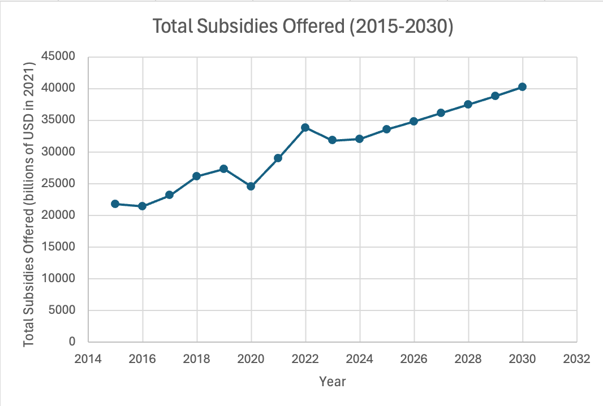
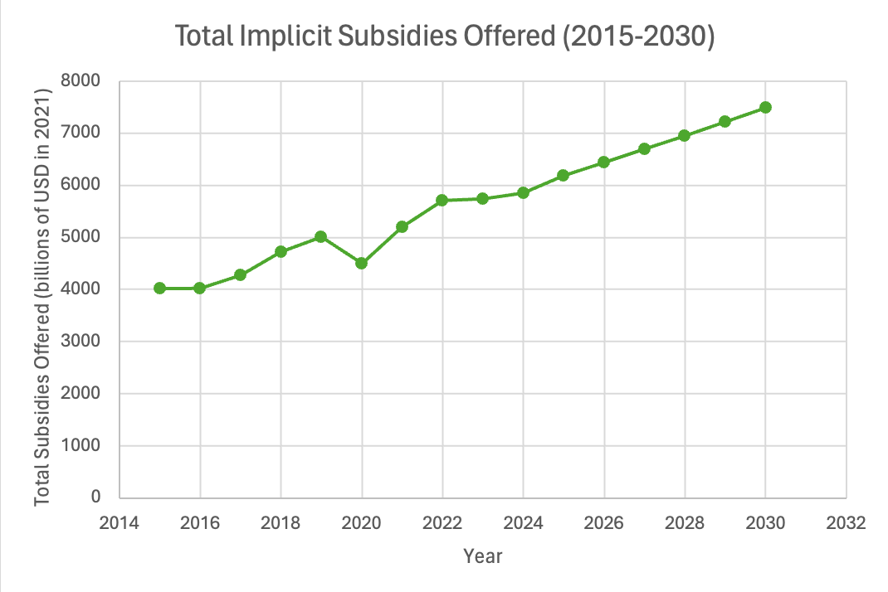

# Spreadsheet Analysis
A little assignment to practice finding data, munging it, and analyzing it in a spreadsheet program.

# Data Set Details
This data set records the total amounts of fossil fuels subsidies offered by different countries from 2015 to 2030 (includes prediction). Data was from IMF and IMF prediction. The URL for this data set can be found [here](https://climatedata.imf.org/datasets/d48cfd2124954fb0900cef95f2db2724_0/explore). The original data was in csv format.

## Original Data File
| Country  | Indicator | Unit | 2015 | 2016 | 2017 | 2018 | 2019 | 2020 | 2021 | 2022 | 2023 | 2024 | 2025 | 2026 | 2027 | 2028 | 2029 | 2030 |
| ------------- | ------------- | ------------- | ------------- | ------------- | ------------- | ------------- | ------------- | ------------- | ------------- | ------------- | ------------- | ------------- | ------------- | ------------- | ------------- | ------------- | ------------- | ------------- |
| Afghanistan, Islamic Rep. of  | Explicit Fossil Fuel Subsidies - Coal  | USD at constant 2021 prices | 0 | 0 | 0 | 0 | 0 | 0 | 0 | 0 | 0 | 0 | 0 | 0 | 0 | 0 | 0 | 0 |
| Afghanistan, Islamic Rep. of  | Explicit Fossil Fuel Subsidies - Electricity  | USD at constant 2021 prices | 0 | 0 | 0 | 0 | 0 | 0 | 0 | 0 | 0 | 0 | 0 | 0 | 0 | 0 | 0 | 0 |
| Afghanistan, Islamic Rep. of  | Explicit Fossil Fuel Subsidies - Natural Gas  | USD at constant 2021 prices | 0 | 0 | 0 | 0 | 0 | 0 | 0 | 0 | 0 | 0 | 0 | 0 | 0 | 0 | 0 | 0 |
| Afghanistan, Islamic Rep. of  | Explicit Fossil Fuel Subsidies - Petroleum  | USD at constant 2021 prices | 253.023 | 264.037 | 223.628 | 41604091.55 | 36861933.38 | 241.16 | 145645135 | 435907964.8 | 95078614.76 | 35298756.71 | 22165437.54 | 10367551.78 | 3.64 | 0 | 0 | 0 |
| Afghanistan, Islamic Rep. of  | Explicit Fossil Fuel Subsidies - Total  | USD at constant 2021 prices | 253.023 | 264.037 | 223.628 | 41604091.55 | 36861933.38 | 241.16 | 145645135 | 435907964.8 | 95078614.76 | 35298756.71 | 22165437.54 | 10367551.78 | 3.64 | 0 | 0 | 0 |
| Afghanistan, Islamic Rep. of  | Fossil Fuel Subsidies - Total Implicit and Explicit  | USD at constant 2021 prices | 921795165.4 | 731458976.5 | 828106544.6 | 1158454184 | 1356822787 | 1300619927 | 1810262178 | 2283950153 | 2064625111 | 1996528619 | 2050356984 | 2102863320 | 2155712124 | 2210504195 | 2269509307 | 2330534278 |
| Afghanistan, Islamic Rep. of  | Fossil Fuel Subsidies - Total Implicit and Explicit -  Natural Gas  | USD at constant 2021 prices | 0 | 0 | 0 | 0 | 15941657.87 | 15490918 | 16659423.98 | 15447341.98 | 24182322.79 | 24677036.42 | 26367316.96 | 28242229.17 | 29474886.26 | 30464991.95 | 31277707.83 | 32094981.71 |
| Afghanistan, Islamic Rep. of  | Fossil Fuel Subsidies - Total Implicit and Explicit - Coal | USD at constant 2021 prices | 297586597.7 | 308467173.7 | 380033214.7 | 441743227 | 475003300.3 | 474392758.6 | 547984219.5 | 572351797.9 | 741454865.4 | 765206838.4 | 797729321.9 | 826456102 | 854104627.1 | 882211820.4 | 911163284.9 | 940829082.3 |
| Afghanistan, Islamic Rep. of  | Fossil Fuel Subsidies - Total Implicit and Explicit - Electricity | USD at constant 2021 prices | 0 | 0 | 0 | 0 | 0 | 0 | 0 | 0 | 0 | 0 | 0 | 0 | 0 | 0 | 0 | 0 |
| Afghanistan, Islamic Rep. of  | Fossil Fuel Subsidies - Total Implicit and Explicit - Petroleum | USD at constant 2021 prices | 624208567.8 | 422991802.8 | 448073329.9 | 716710957.5 | 865877828.9 | 810736249.9 | 1245618535 | 1696151013 | 1298987923 | 1206644744 | 1226260346 | 1248164989 | 1272132610 | 1297827383 | 1327068314 | 1357610214 |
| Afghanistan, Islamic Rep. of  | Implicit Fossil Fuel Subsidies - Accidents  | USD at constant 2021 prices | 164446626.6 | 109755642.7 | 114351810.5 | 178872978.9 | 218162305 | 211671384.1 | 237466765.2 | 250443037.8 | 250547254.1 | 250728512.2 | 259534894.6 | 268678964.8 | 278139693.3 | 286014185.3 | 295097275.3 | 304616990.9 |
| Afghanistan, Islamic Rep. of  | Implicit Fossil Fuel Subsidies - Coal | USD at constant 2021 prices | 297586597.7 | 308467173.7 | 380033214.7 | 441743227 | 475003300.3 | 474392758.6 | 547984219.5 | 572351797.9 | 741454865.4 | 765206838.4 | 797729321.9 | 826456102 | 854104627.1 | 882211820.4 | 911163284.9 | 940829082.3 |
| Afghanistan, Islamic Rep. of  | Implicit Fossil Fuel Subsidies - Congestion | USD at constant 2021 prices | 58795862.38 | 39241775.87 | 40885078.97 | 63953826.66 | 78001240.45 | 68354097.9 | 75648163.78 | 76245921.87 | 72903666.96 | 69820299.81 | 69188737.55 | 68673739.98 | 68212258.94 | 67345385.09 | 66778108.42 | 66306509.06 |
| Afghanistan, Islamic Rep. of  | Implicit Fossil Fuel Subsidies - Electricity | USD at constant 2021 prices | 0 | 0 | 0 | 0 | 0 | 0 | 0 | 0 | 0 | 0 | 0 | 0 | 0 | 0 | 0 | 0 |
| Afghanistan, Islamic Rep. of  | Implicit Fossil Fuel Subsidies - Foregone VAT | USD at constant 2021 prices | 0 | 0 | 0 | 0 | 0 | 0 | 274804935.1 | 339205996.7 | 327977337.1 | 306068570.7 | 309183926.2 | 312311481.4 | 315516114.1 | 318678628.9 | 322301799.5 | 326082465.3 |
| Afghanistan, Islamic Rep. of  | Implicit Fossil Fuel Subsidies - Global Warming | USD at constant 2021 prices | 522406611.2 | 438821466.8 | 507853682.2 | 667296202.9 | 778184975.9 | 757878549.7 | 793231641.3 | 863270952.8 | 958961880.5 | 960098198.1 | 990918734 | 1018686775 | 1044380596 | 1065890981 | 1087558405 | 1109335327 |
| Afghanistan, Islamic Rep. of  | Implicit Fossil Fuel Subsidies - Local Air Pollution | USD at constant 2021 prices | 163421711.3 | 134836509 | 154667231.4 | 194212935.2 | 228293736.3 | 245802152.6 | 264755004.4 | 299230219.1 | 338527994.3 | 352854500.5 | 376622484.3 | 400264897.9 | 424411920.4 | 446927994.9 | 471250467.9 | 496724373.6 |
| Afghanistan, Islamic Rep. of  | Implicit Fossil Fuel Subsidies - Natural Gas | USD at constant 2021 prices | 0 | 0 | 0 | 0 | 15941657.87 | 15490918 | 16659423.98 | 15447341.98 | 24182322.79 | 24677036.42 | 26367316.96 | 28242229.17 | 29474886.26 | 30464991.95 | 31277707.83 | 32094981.71 |
| Afghanistan, Islamic Rep. of  | Implicit Fossil Fuel Subsidies - Petroleum | USD at constant 2021 prices | 624208314.7 | 422991538.8 | 448073106.2 | 675106866 | 829015895.5 | 810736008.8 | 1099973400 | 1260243048 | 1203909308 | 1171345988 | 1204094908 | 1237797437 | 1272132607 | 1297827383 | 1327068314 | 1357610214 |

- Display some of the raw data from the original data file (the first 20 rows is enough). Use Markdown's ability to display tables - see the examples in the Markdown guide linked above.
- Generally, the data set that I found was pretty neat - it's already in cvs format, and there are not additional keys. However, there are many columns that have information redundant - they all describe the indicators, so I choose to remove them when cleaning the raw data via Python.
- Links to my data files:
    - [original data](data/Fossil_Fuel_Subsidies.cvs)
    - [munged data](data/clean_data.cvs)
    - [spreadsheet file](data/spreadsheet_analysis.xlsx)

# Analysis

## Aggregate Statistics
### Total Subsidies offered in 2015 (billions of USD in 2021)
This is the total value of subsidies offered by all countries in 2015. The value is in 2021 USD, suggesting that the data is probably collected in 2021. The number is enormous - suggesting that in 2015 people have not yet started to concern the negative externalities offered by fossil fuels.

### Average amount of Subsidies offered by different countries in 2015 (billions of USD in 2021)
This is the average amount of subsidies offered by countries around the world in 2015, valued by USD in 2021. This suggest a similar message to the first aggregate sum, but showing more straightforwardly that there was a lot of money being put into subsidising fossil fuels - which could be due to trying to boost the economy.

### Total Subsidies offered in 2021 (billions of USD in 2021)
This is the total value of subsidies offered by all countries in 2015, valued by USD in 2021. Interestingly, while this might be the newest data collected by the source since it is 2021's data, the value is larger than 2015. This may suggests that while there may be developed countries who started to concern negative impacts of fossil fuels, most countries are still in the process of economic development. 

### Average amount of Subsidies offered by different countries in 2021 (billions of USD in 2021)
This is the average value of subsidies offered by all countries in 2021, valued by USD in 2021. It is 2 billion larger than the data from 2015, suggesting that people are still subsidising fossil fuels.

### Total Implicit Subsidies offered in 2015 (billions of USD in 2021)
This is the total value of implicit subsidies offered by all countries in 2015, valued by USD in 2021. These are subsidies that are not directly correlated with consumer retail price. Some examples are tax exemptions for coal factories.

### Total Explicit Subsidies offered in 2015 (billions of USD in 2021)
This is the total value of explicit subsidies offered by all countries in 2015, valued by USD in 2021. These are subsidies directly related to what consumers pay to firms concerning fossil fuels. The value for explicit subsidies is much smaller than implicit subsidies.

### Total Implicit Subsidies offered in 2021 (billions of USD in 2021)
This is the total value of implicit subsidies offered by all countries in 2021, valued by USD in 2021. Total implicit subsidies have risen from 2015 as well, following the trend for general subsidies.

### Total Explicit Subsidies offered in 2021 (billions of USD in 2021)
This is the total value of explicit subsidies offered by all countries in 2021, valued by USD in 2021. There is also an increase for purely explicit subsidies, suggesting the increasing trend for the aggregate as well.

## Chart


This is the graph showing the general trend of total subsidies offered from 2015 to 2030. The trend is increasing. However, there is a sharp drop at 2020 and a steep increase from 2020 to 2022. This could be due to the fact that covid happened at 2020, so government would be generally more willing to provide subsidies to factories including fossil fuel factories, trying to help the economy to recover.

This is the graph for the total implicit cost from 2015 to 2030. Generally, the trend is similar to the first graph.

This is the graph for total explicit cost from 2015 to 2030. There is a very steep increase from 2020 to 2022, so what the government subsidises for covid may be mostly explicit subsidies. Also, since the value of explicit subsidies is much smaller than implicit subsidies, they are not as influential as the latter.


```
Extra-credit

This assignment deserves extra credit because there are thousands of rows are included in the raw data.
```